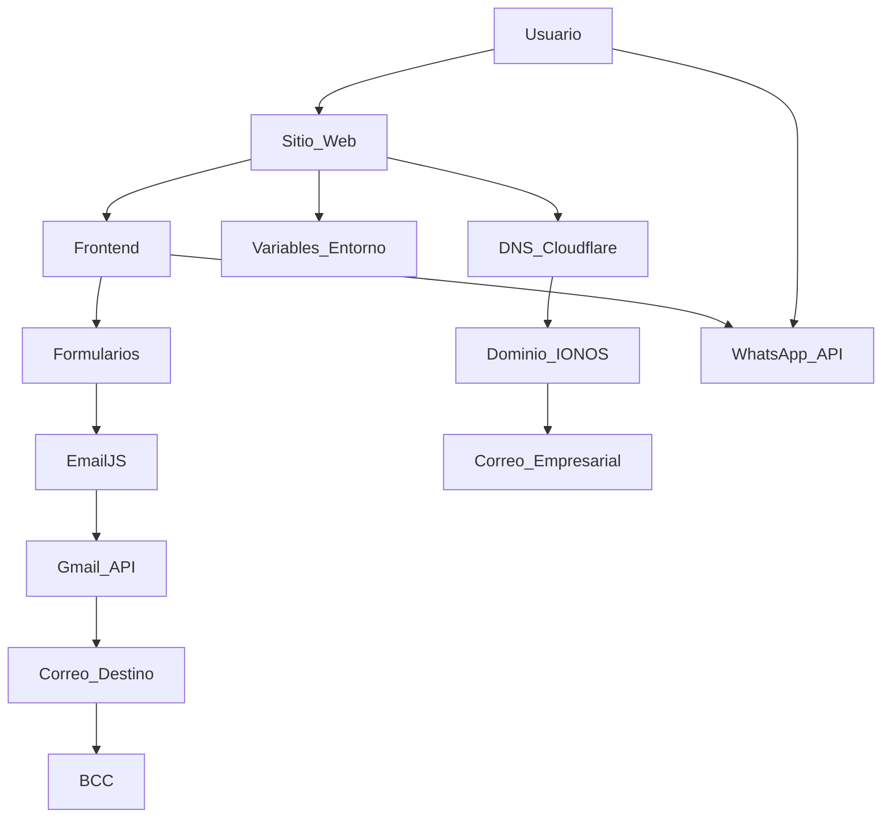

# Transportes C&N - Sitio Web de Mudanzas

Este proyecto corresponde al sitio web oficial de **Transportes C&N**, una empresa dedicada a brindar servicios de mudanzas y transporte personalizado. El sitio está desarrollado con tecnologías modernas y se apoya en múltiples servicios para su funcionamiento, administración y comunicación.

---

## 🌐 Despliegue y Hosting

### **Vercel**
- **Descripción:** Plataforma utilizada para el despliegue automático del sitio web desde GitHub.
- **Ingreso:** Se accede mediante la cuenta de correo principal del desarrollador.
- **Funciones:**
  - Despliegue continuo conectado al repositorio GitHub.
  - Administración de variables de entorno.
  - Dominio personalizado conectado a través de DNS.
  - Configuración de redirección para subdominios (www).

---

## 🛠️ Desarrollo

### **GitHub**
- **Repositorio:** [web-mudanza](https://github.com/Camilo-Correa/web-mudanza)
- **Descripción:** Repositorio principal que contiene todo el código fuente del sitio.
- **Funciones:**
  - Control de versiones.
  - Automatización del despliegue con Vercel.
  - Documentación del proyecto.

---

## ☁️ Gestión de Dominio y Correo

### **IONOS**
- **Descripción:** Plataforma utilizada para la compra y administración del dominio `transportescn-mudanzas.es` y el correo corporativo.
- **Funciones:**
  - Gestión de DNS (entradas A, CNAME, MX, TXT).
  - Configuración de correos institucionales.
  - Soporte para DKIM, SPF y DMARC para seguridad de correo.

---

## 🌩️ Administración de DNS

### **Cloudflare**
- **Descripción:** Servicio de administración de DNS utilizado para mejorar rendimiento y seguridad.
- **Funciones:**
  - Administración de entradas DNS personalizadas.
  - Aceleración y protección del sitio web.
  - Verificación de dominios para integraciones externas.

---

## 📩 Comunicación y Formularios

### **EmailJS**
- **Descripción:** Plataforma utilizada para el envío de correos automáticos desde los formularios del sitio web.
- **Integraciones:**
  - Gmail API (como proveedor de envío).
- **Plantillas utilizadas:**
  - `Contact Home`: Solicitud de llamada de servicio.
  - `Contact Us`: Solicitud general de mudanza.
- **Funciones:**
  - Envío de correos automatizados al correo corporativo.
  - Inclusión de campos personalizados (`nombre`, `email`, etc.).
  - Envío de copia (BCC) a correos administrativos.

---

## 🔐 Variables de Entorno

Las variables de entorno necesarias para el correcto funcionamiento de la comunicación con EmailJS y servicios externos están configuradas desde Vercel y se aplican automáticamente en todos los entornos de despliegue.

---

## 📦 Estructura del Proyecto (Frontend)

- **Framework:** React + Vite
- **Componentes clave:**
  - Página de inicio
  - Sección de servicios
  - Formulario de presupuesto
  - Página de contacto
  - Consejos de embalaje
- **Integraciones:**
  - Botón flotante de WhatsApp
  - Formularios conectados a EmailJS
  - Envío automático de solicitudes

---

## 📌 Notas Finales

Este proyecto sigue en evolución y contempla futuras mejoras como:
- Dashboard de administración.
- Calendario de reservas.
- Estadísticas de clientes.

Para contribuir o desplegar este sitio en un entorno propio, por favor solicita acceso a las variables y servicios al desarrollador principal.

---

## Diagrama de Despliegue - Transportes C&N

© 2025 - Transportes C&N. Todos los derechos reservados.
